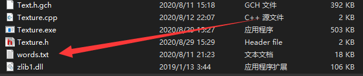
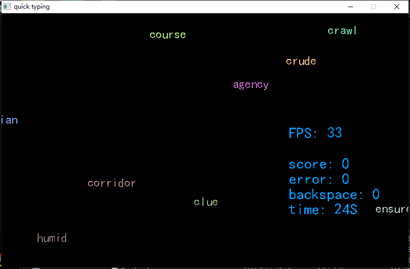

# quickTyping

## introduce
自定义、简洁打字练习软件
使用`c++11`采用`SDL2.0`编写

## compile 

需要自定义编译的可以添加一下编译参数

```bash
g++ *.cpp -o main_v2 -lmingw32 -lSDL2main -lSDL2  -lSDL2_ttf -lSDL2_image
```
或者直接下载二进制文件

## Usage

词库放入本地目录`words.txt`中， 会**自动随机**选择单词进行联系
  
* words.txt



* 使用截图
